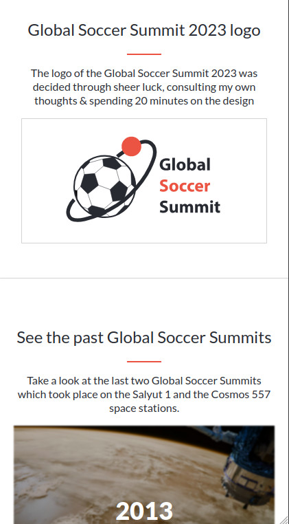

# Project Name
Global Soccer Summit

# Description the project.
A Capstone project to work on my (HTML, CSS & JavaScript) skills.

## Built With

HTML
CSS
JavaScript
Git commands & VSCode(text editor)

## Screenshots

## Link to the Page

[Live Version](https://peter1907.github.io/capstone01/)

## Authors

👤 **Author1**

- GitHub: [@Peter1907](https://github.com/Peter1907)
- Twitter: [@Peter_Beshara_](https://twitter.com/Peter_Beshara_)
- LinkedIn: [LinkedIn](https://www.linkedin.com/in/peter-beshara-b33681241/)

## 🤝 Contributing

Contributions, issues, and feature requests are welcome!

You can clone the repo using this link (https://github.com/Peter1907/capstone01.git)

Feel free to check the [issues page](https://github.com/Peter1907/capstone01/issues).

## Show your support

Give a ⭐️ if you like this project!

## Acknowledgments

- Images used for the past events section

  Photo by <a href="https://unsplash.com/@nasa?utm_source=unsplash&utm_medium=referral&utm_content=creditCopyText">NASA</a> on <a href="https://unsplash.com/s/photos/space-station?utm_source=unsplash&utm_medium=referral&utm_content=creditCopyText">Unsplash</a>

  Photo by <a href="https://unsplash.com/@spacex?utm_source=unsplash&utm_medium=referral&utm_content=creditCopyText">SpaceX</a> on <a href="https://unsplash.com/s/photos/space-station?utm_source=unsplash&utm_medium=referral&utm_content=creditCopyText">Unsplash</a>

- Icons

  <a target="_blank" href="https://icons8.com/icon/98972/facebook-f">Facebook F</a> icon by <a target="_blank" href="https://icons8.com">Icons8</a>

  <a target="_blank" href="https://icons8.com/icon/13963/twitter">Twitter</a> icon by <a target="_blank" href="https://icons8.com">Icons8</a>

- The design & the icons in the program section is from <a href="https://www.behance.net/gallery/29845175/CC-Global-Summit-2015">Cindy Shin original design</a>

- The menu icon, the close icon, the background, the logo, the pattern in the program section & the white ball icon are created by me.

## 📝 License

This project is [MIT](./MIT.md) licensed.